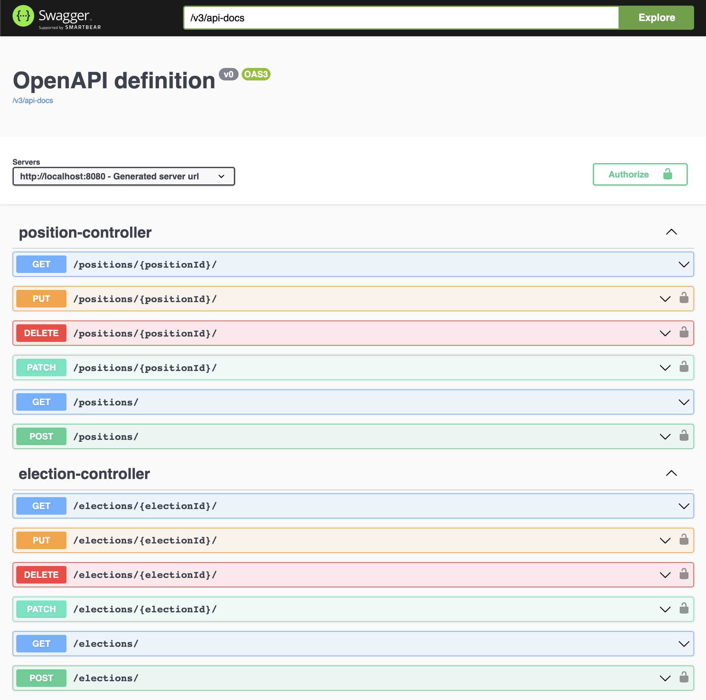

# Backend of Student Voting Portal (Java)

## Run

### Sync database
- Database settings
    - Run a mysql database locally
    - Create a mysql user
        - username: `student_voting_portal`
        - password: `student_voting_portal`
    - Create a database: `student_voting_portal_java`
    - Grant new user with permissions to operate the new database
- Ps. If you do not want to run a mysql
    - Go to `src/main/resources/application.yaml`
    - Comment `MySQL` part and uncomment `H2` part

### Test
```shell
./mvnw test
```

### Run the server

#### Development mode
```shell
./mvnw spring-boot:run
```

#### Production mode
```shell
./mvnw package -DskipTests
java -jar target/student_voting_portal-0.0.1-SNAPSHOT.jar
```

- visit API Root page: http://localhost:8080/swagger-ui.html
- Login with superuser and send request with the given JWT to have full permission in API Root page

### Superuser
- Superuser will create on running the server
- Configuration is at `src/main/java/edu/scu/studentvotingportal/config/SuperuserConfig.java`
- Default superuser:
  - email: `super@gmail.com`
  - password: `super`

#### Send request with JWT token 
- Process: login -> get JWT token -> access with JWT token
  - **Login**: send a `POST` request to `/authentication/` endpoint with email and password. 
  - **JWT token**: In API docs, the upper-right side has a `Authorize` icon, where you can put your JWT token.

#### API docs preview


