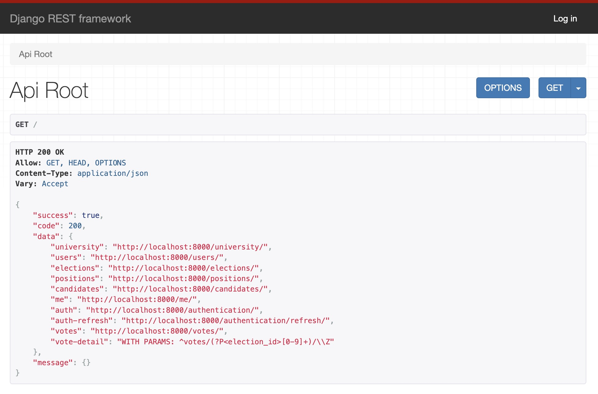

# Backend of Student Voting Portal (Python)


## Run

### Activate venv and install dependencies
```shell
# activate venv
python -m venv venv
source venv/bin/activate
# install dependencies
python -m pip install -r requirements.txt
```

### Sync database
- Database settings
  - Run a mysql database locally
  - Create a mysql user
    - username: `student_voting_portal`
    - password: `student_voting_portal`
  - Create a database: `student_voting_portal_py`
  - Create a database: `test_student_voting_portal_py` (for test)
  - Grant new user with permissions to operate the new database
- Ps. If you do not want to run a mysql
  - Go to `settings/dev.py`
  - In `DATABASES`, comment `mysql` part and uncomment `sqlite3` part

```shell
python manage.py makemigrations
python manage.py migrate
```

### Test
```shell
python manage.py test
```

### Create superuser
```shell
python manage.py createsuperuser --email super@gmail.com
# Then set password for superuser
```

### Run the server
```shell
python manage.py runserver
```

- visit API Root page: http://localhost:8000
- Login with superuser to have full permission in API Root page

#### API docs preview



### Exit venv
```shell
deactivate
```
